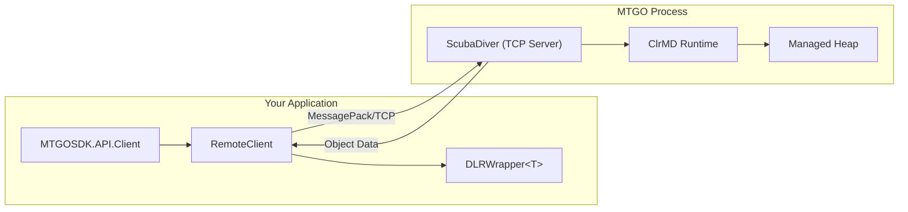
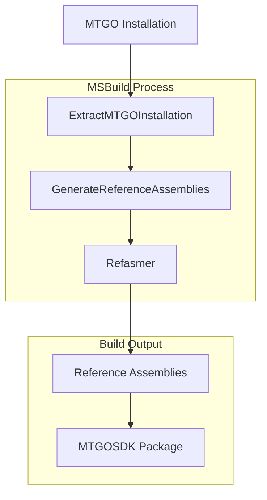

# Architecture

This directory provides documentation on SDK internals and design decisions for contributors.

For API documentation, see the [Reference](../reference/README.md). For task-oriented tutorials, see the [Guides](../guides/README.md).

<table>
  <tr>
    <th>Namespace</th>
    <th>Class</th>
    <th>Description</th>
  </tr>
  <tr>
    <td rowspan="8"><code>MTGOSDK.Core</code></td>
    <td><a href="./dlr-wrapper.md">DLRWrapper</a></td>
    <td>Type-safe interface binding for dynamic remote objects</td>
  </tr>
  <tr>
    <td><a href="./remote-client.md">RemoteClient</a></td>
    <td>Low-level class for accessing remote objects in MTGO memory</td>
  </tr>
  <tr>
    <td><a href="./logging.md">Logging</a></td>
    <td>Structured logging with automatic caller detection</td>
  </tr>
  <tr>
    <td><a href="./events.md">Events</a></td>
    <td>Event proxies and hooks for remote event subscription</td>
  </tr>
  <tr>
    <td><a href="./threading.md">Threading</a></td>
    <td>Task scheduling and background thread management</td>
  </tr>
  <tr>
    <td><a href="./serialization.md">Serialization</a></td>
    <td>Batch property fetching for performance optimization</td>
  </tr>
  <tr>
    <td><a href="./type-compilation.md">Type Compilation</a></td>
    <td>Runtime proxy generation and expression compilation</td>
  </tr>
  <tr>
    <td><a href="./memory.md">Memory</a></td>
    <td>GC coordination and remote object reference management</td>
  </tr>
</table>

---

## Overview

This project consists of three main components:

* **MTGOSDK** - A library providing high-level APIs for interacting with the MTGO client (see [Reference](../reference/README.md))
* **MTGOSDK.MSBuild** - MSBuild tasks for compile-time code generation and reference assembly extraction
* **MTGOSDK.Win32** - Win32 API definitions and helpers used by the SDK

---

## How the SDK Works

MTGOSDK connects to the running MTGO process and inspects its memory to access internal objects. Rather than modifying or patching the client code, the SDK uses Microsoft's ClrMD (Common Language Runtime Debugging) library to read .NET objects directly from the managed heap.

The connection works through a component called ScubaDiver, which is injected into the MTGO process. ScubaDiver runs as a TCP server inside MTGO, responding to requests from the SDK to locate objects, read properties, and invoke methods. Communication uses MessagePack for efficient binary serialization between the SDK and ScubaDiver. ScubaDiver itself performs minimal reflection by design; the SDK handles most reflection work locally using type metadata fetched from the process.



When you access an MTGO object through the API (like `CollectionManager.Decks`), the SDK:

1. Sends a request to ScubaDiver to find the object in MTGO's heap
2. ScubaDiver uses ClrMD to locate and serialize the object's data
3. The SDK wraps the response in a `DynamicRemoteObject` for property access
4. The `DLRWrapper` class binds an interface to provide compile-time type safety

This approach means the SDK can read any object MTGO has in memory without requiring client modifications or reverse engineering of network protocols.

---

## The DLR Architecture

The SDK uses the Dynamic Language Runtime (DLR) to bridge the gap between your strongly-typed C# code and the dynamic objects retrieved from MTGO's memory.

At the foundation is `DynamicRemoteObject` (DRO), which wraps the raw data returned from ScubaDiver. This dynamic object intercepts property access and method calls, forwarding them as remote procedure calls to the running MTGO process. Under the hood, DRO is backed by `RemoteObject` and `RemoteType`, which hold cached references to the remote object's memory address and type metadata respectively.

The `TypeProxy` class is what actually builds the runtime assembly that bypasses dynamic dispatching. When you call `Bind<T>()`, TypeProxy generates a compiled proxy that maps interface members directly to DRO property accesses. This avoids the overhead of dynamic dispatch on every call while still pulling data from MTGO at runtime.

`DLRWrapper<T>` provides utilities on top of these proxy objects and DROs. One useful behavior is automatic unwrapping: when you pass a `DLRWrapper` to a constructor like `public Deck(...) : this(new Deck(dro))`, the wrapper extracts the underlying `dro` object from the `obj` field. This means you can pass either a raw DRO or another wrapper, and the SDK will find the actual remote object.

Here's a simplified view of how a wrapper class works:

```csharp
// The interface defines what properties you want to access
public interface IDeck
{
  string Name { get; }
  int ItemCount { get; }
}

// The wrapper binds the interface to a dynamic remote object
public class Deck(dynamic deck) : DLRWrapper<IDeck>
{
  /// <summary>
  /// Stores an internal reference to the IDeck object.
  /// </summary>
  internal override dynamic obj => Bind<IDeck>(deck);

  public Deck(/* ... */)
      // We use a nested constructor to avoid using dynamic dispatch.
      // This gets unwrapped in the DLRWrapper constructor.
      : this(new Deck(RemoteClient.CreateInstance<WotC.MtGO.Client.Model.Core.Collection.Deck>()))
  {
    var deckItems = RemoteClient.CreateArray<DeckItem_t>(/* ... */);
    Unbind(this).ReconcileCards(deckItems);
  }

  //
  // IDeck wrapper properties
  //

  public string Name => @base.Name;
  public int ItemCount => @base.ItemCount;
}
```

The `Bind<T>()` call triggers TypeProxy to generate and cache a compiled proxy for the interface. The `@base` property exposes this proxy, routing calls like `@base.Name` through the generated assembly to the underlying DRO. If you need to access a property that isn't in the interface, `Unbind()` returns the raw dynamic object.

This example uses a primary constructor to handle the dynamic dispatching of the `deck` dynamic remote object, and shows how to wrap a remote object when creating other constructors. Here, `RemoteClient.CreateInstance<T>()` creates an IDeck object in the MTGO client, which is then wrapped in a Deck object. Afterwards, we call `ReconcileCards` on the dro (`Unbind(this)` or `Unbind(@base)`), passing in an array of remote `DeckItem_t` objects to update the deck's card list.

Note that when we call `ReconcileCards` on the dro, we must pass in a remote object, as the TypeProxy types cannot be marshalled to the MTGO process for non-primitive types. If you pass in a DLRWrapper object, this will be unwrapped automatically to expose the underlying remote object.

For more details on type binding, see [DLRWrapper](./dlr-wrapper.md).

---

## Reference Assembly Generation

MTGO's internal types aren't publicly documented, but the SDK needs to know about them at compile time so you can write code against interfaces like `ICardDataManager` or `ISession`.

MTGOSDK.MSBuild handles this by extracting reference assemblies from MTGO's installed binaries. When you build a project using the SDK, MSBuild tasks:

1. Locate the MTGO installation (or download it if needed)
2. Extract the client assemblies from the ClickOnce deployment
3. Generate reference assemblies containing only type signatures (no implementation)
4. Make these types available for compilation

The reference assembly generator uses JetBrains Refasmer to strip implementation details from MTGO's assemblies, leaving just the public type definitions. This gives you autocomplete and compile-time type checking without distributing any of Daybreak's actual code.



When MTGO updates, you can regenerate these reference assemblies to pick up any new types or API changes. The SDK package on NuGet includes pre-generated reference assemblies, so most users don't need to run this process manually.

---

## Component Details

### MTGOSDK

The main library exposes high-level abstractions over MTGO's internal services. Rather than dealing directly with memory inspection, you work with classes like `Client`, `CollectionManager`, and `EventManager` that provide clean APIs for common tasks.

The library injects ScubaDiver into the MTGO process using ClrMD, then communicates over TCP using MessagePack serialization. All remote objects are wrapped in `DynamicRemoteObject` instances and optionally bound to interfaces through `DLRWrapper<T>`.

Performance is a priority. The SDK caches object references, batches property fetches where possible, and avoids blocking MTGO's UI thread by executing calls on it's own background thread. Long-running or UI-dependent operations use async patterns to prevent any potential degradation of the player experience wherever possible.

### MTGOSDK.MSBuild

This package provides MSBuild tasks that run during compilation:

- **ExtractMTGOInstallation** - Locates or downloads MTGO, extracts client assemblies from the ClickOnce deployment
- **GenerateReferenceAssemblies** - Uses Refasmer to create type-only reference assemblies from MTGO's binaries

These tasks are wired up automatically when you reference the MTGOSDK package. They ensure your project has access to MTGO's type definitions without bundling any implementation code.

### MTGOSDK.Win32

Low-level Windows API definitions used by the SDK. This includes functions for process enumeration, window management, memory operations, and COM interop.

The library provides C# wrappers around Win32 functions that aren't exposed by the .NET BCL, ensuring consistent behavior across Windows versions. It's not intended for direct use by SDK consumers.

---

## Further Reading

- [Guides](../guides/README.md) - Task-oriented tutorials for all API features
- [Reference](../reference/README.md) - Per-namespace API documentation
- [Getting Started](../getting-started.md) - How to connect to MTGO and start using the API
