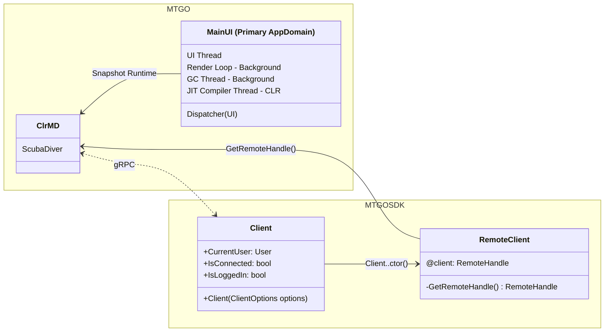
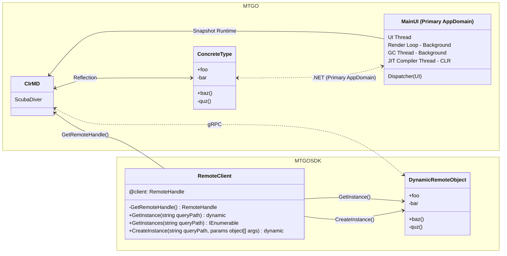
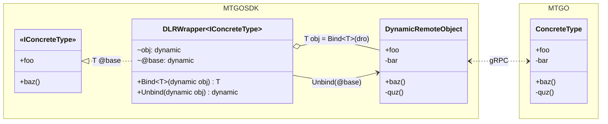

# MTGOSDK - Core Classes

This document covers core classes used throughout the **MTGOSDK** library, providing a technical overview of classes that interact with the MTGO client. This document is intended for developers who are familiar with the .NET runtime and the C# programming language, and who are interested in developing applications with this SDK that interact with the MTGO client.

## MTGOSDK.API.Client

The [`Client`](MTGOSDK/src/API/Client.cs) class is the main entry point for interacting with the MTGO client, managing the connection to the client and the current user session. This useful for managing both passive and active connections to the client, and helps ensure that sessions are properly managed and cleaned up when the client is closed.

Below is a UML diagram of the instantiated Client class, which propagates the connection to the MTGO client and provides a way to access remote objects in the client's memory space.



Under the hood, this class instantiates a [`RemoteClient`](#remoteclient) instance to manage the connection to the client, and provides a way to access remote objects in the client's memory space. This class is initialized when creating a new instance of the [`Client`](MTGOSDK/src/API/Client.cs) class or when interacting with any dynamic remote objects in the **MTGOSDK.API** namespace (refer to [`examples/GameTracker`](examples/GameTracker) for an example of implicit instantiation).

<!-- <table align="center">
<tr>
<td>Explicit Instantiation</td>
<td>Implicit Instantiation</td>
</tr>
<tr>
<td>

```C#
using MTGOSDK.API; // Client

using var client = new Client();
```

</td>
<td>

```C#
using MTGOSDK.API.Collection; // CollectionManager

IEnumerable<Deck> decks = CollectionManager.Decks;
```

</td>
</tr>
</table> -->

### Initializing the Client

We can use the **Client** class to manage the connection to the MTGO client, ensuring that the session is properly terminated and cleaned up when the client is closed. This is demonstrated in the following example, which checks if the client is logged in, retrieves the current user session, and handles the client disconnection event.

```C#
using System;      // InvalidOperationException
using MTGOSDK.API; // Client

using (var client = new Client())
{
  if (!Client.IsLoggedIn)
    throw new InvalidOperationException("The MTGO client is not logged in.");

  string username = client.CurrentUser.Name;
  Console.WriteLine($"The current MTGO session is under '{username}'.");

  // Teardown when the MTGO client disconnects.
  client.IsConnectedChanged += delegate(object? sender)
  {
    if (!client.IsConnected)
    {
      Console.WriteLine("The MTGO client has been disconnected. Stopping...");
      client.Dispose(); // Manually dispose of our connection to the client.
      Environment.Exit(-1);
    }
  };

  // Do something with the client session.
}
// The connection to MTGO is automatically torn down when the using block exits.
```

You can find a complete example in the [`examples/BasicBot`](examples/BasicBot) directory, which demonstrates how to use the **Client** class to automatically start and stop the MTGO client and manage the client session. Note that for interactive use (where a user had logged in manually and is not a bot), these options are much more limited to prevent abuse.

### Using Client Events

We can also use the **Client** class to drive a simple event-based architecture, allowing us to respond to events that occur in the MTGO client. This is possible for most classes in the API but is best demonstrated in the following example, which listens for error events and logs the error message to the console.

```C#
using System;             // Exception
using MTGOSDK.API;        // Client
using MTGOSDK.API.Events; // ErrorEventCallback, ErrorEventArgs

using var client = new Client();

client.ErrorReceived += ErrorEventCallback(ErrorEventArgs args)
{
  Exception ex = args.Exception;
  Console.WriteLine($"MTGO encountered an error: {ex.Message}");

  // Handle the error event.
}
```

Many classes in the **MTGOSDK.API** namespace will aggregate and provide their own event handlers, allowing us to respond to events that occur in the MTGO client. No specific priority is given to event handlers from the **Client** class, though callbacks registered with the **Client** class should be reserved for exceptional circumstances.

### Logging Dependency Injection

As the **Client** class is intended to be the entrypoint for interacting with the MTGO client, we can also provide a custom logger to the **Client** class to log messages to a custom logging provider. This is demonstrated in the following example, which uses the **Client** class to log messages to the console.

```C#
using Microsoft.Extensions.Logging; // ILoggerFactory, LoggerFactory
using MTGOSDK.API;                  // Client

ILoggerFactory factory = LoggerFactory.Create(builder =>
{
  builder.AddConsole();
  builder.SetMinimumLevel(LogLevel.Information);
  // Add additional logging configuration here.
});

using var client = new Client(loggerFactory: factory);
```

Now we can collect logs from the **Client** class and its associated classes, and output them to the console. This is useful for debugging and monitoring the client's behavior, and can be extended to include additional logging providers such as **Serilog** or **NLog**.

You can also manually log messages to the logger by using the **Log** class provided by `MTGOSDK.Core.Logging`:

```C#
using Microsoft.Extensions.Logging; // ILoggerFactory, LoggerFactory
using MTGOSDK.API;                  // Client
using MTGOSDK.Core.Logging;         // Log

ILoggerFactory factory = LoggerFactory.Create(builder => /* ... */);
using var client = new Client(loggerFactory: factory);

Log.Trace("This is a trace message.");
Log.Debug("This is a debug message.");
Log.Information("This is an informational message.");
Log.Warning("This is a warning message.");
Log.Error("This is an error message.");
Log.Critical("This is a critical message.");
```

This will use the same **ILoggerFactory** instance that was provided to the **Client** class, and will output log messages to the logger provider with automatic type/category deduction. This is useful for logging messages from classes that do not have access to the logger provider, and are used to log messages from any class in the **MTGOSDK** library.

## MTGOSDK.Core.Remoting.RemoteClient

The [`RemoteClient`](MTGOSDK/src/Core/Remoting/RemoteClient.cs) class is a static class that manages the connection to the MTGO client, providing a way to access remote objects in client memory. This class is used to bootstrap a connection to the MTGO client and create DynamicRemoteObject instances that can be used to proxy interactions with remote objects.

Below is a UML diagram of the RemoteClient class, which contains methods for creating, retrieving, and invoking remote objects. For now, we'll focus only on a subset of APIs for fetching and creating remote objects.



Here we use the RemoteClient to inject ClrMD into the MTGO process, allowing us to start the Snapshot Runtime to locate and interact with remote objects using reflection. The corresponding DynamicRemoteObject class is used to proxy interactions with remote objects, providing a way to interact with objects between processes.

### Fetching Remote Objects

With the `GetInstance()` method, we can create a dynamic object that fetches a remote object in the client's heap memory. This method takes a string parameter that represents the fully qualified name of the object to be created, and returns a dynamic object that can be used to interact with the remote object.

We can do so using any of the following methods:

```C#
using MTGOSDK.Core.Reflection; // TypeProxy<T>
using MTGOSDK.Core.Remoting;   // RemoteClient

dynamic objB = RemoteClient.GetInstance(new TypeProxy<Bar>());
dynamic objC = RemoteClient.GetInstance(new TypeProxy<dynamic>(typeof(Bar)));
dynamic objA = RemoteClient.GetInstance("assembly.namespace.Bar");
```

> [!NOTE]
> Objects returned this way must be handled as dynamic objects, which defer type checking to runtime. Refer to the [`DLRWrapper`](#dlrwrapper) class for a way to bind interfaces to dynamic objects in a type-safe manner.

Additionally, multiple instances of the object can be found by using `GetInstances()`, returning an enumerable collection of dynamic objects that represent the remote objects in the client's memory space.

```C#
using MTGOSDK.Core.Reflection; // TypeProxy<T>
using MTGOSDK.Core.Remoting;   // RemoteClient

foreach (dynamic obj in RemoteClient.GetInstances("assembly.namespace.Bar"))
{
  // Do something with obj.
}
```

### Creating Remote Objects

Creating a new instance of a remote object is similarly straightforward, using the `CreateInstance()` method to invoke the object's constructor with the specified arguments. This method takes a string parameter that represents the fully qualified name of the object to be created, and an array of objects that represent the arguments to be passed to the constructor.

Below is an example of creating a new instance of a remote object with the `CreateInstance()` method, using the [`TypeProxy<T>`](MTGOSDK/src/Core/Reflection/Proxy.cs) class to convert the interface type to a string containing the fully qualified name of the object. We'll assume that the `Bar` class has two constructors, one with two arguments and the other with three arguments.

```C#
class Bar : IDisposable
{
  public Bar(int A, string B) { }
  public Bar(int A, string B, string C) { }
  public void Dispose() { }
}
```

```C#
using MTGOSDK.Core.Reflection; // TypeProxy<T>
using MTGOSDK.Core.Remoting;   // RemoteClient

// Invoke the first constructor with 2 arguments (A and B).
dynamic objA = RemoteClient.CreateInstance(new TypeProxy<Bar>(), 1, "foo");
// Invoke the second constructor with 3 arguments (A, B, and C).
dynamic objB = RemoteClient.CreateInstance(new TypeProxy<Bar>(), 2, "bar", "baz");

// Invoke the first constructor and dispose of the object when out of scope.
using (dynamic objC = RemoteClient.CreateInstance(new TypeProxy<Bar>(), 1, "quz"))
{
  // Do something with objC.
}
```

### Remarks

As the `RemoteClient` class is a low-level class that interacts directly with the client's memory space, it is best to limit frequent use of the `RemoteClient` class to cases where the `MTGOSDK.API` classes are not sufficient. Each method in the `RemoteClient` class must traverse the client's memory heap to retrieve or interact with objects, which can be slow and resource-intensive.

As such, it is recommended to use the `MTGOSDK.API` classes or the [`ObjectProvider`](#objectprovider) class where possible, as these classes provide a more optimized code-path for interacting with remote objects in the client's memory space.

## MTGOSDK.Core.Reflection.DLRWrapper

The [`DLRWrapper`](MTGOSDK/src/Core/Reflection/DLRWrapper.cs) class allows for binding interfaces to a dynamic object in a type-safe manner, hiding dynamic dispatching from constructor calls and allowing for the use of interfaces in a dynamic context. This eagerly caches the public members of the dynamic object behind the interface, preventing access to any members that are not declared in the interface type.

Below is a UML class diagram of a DLRWrapper class that binds an interface IConcreteType to a dynamic remote object (dro) that wraps a remote ConcreteType object; we'll omit ClrMD remoting details for brevity.



The `Bind<T>()` and `Unbind()` methods are used to bind and unbind the dynamic object to the DLRWrapper's interface type. At runtime, this generates an assembly that wraps the members of the interface to members of the dynamic object, allowing for type-safe access to the dynamic object's members at both compile-time and runtime.

The `obj` property is the dynamic object that the DLRWrapper is bound to, which the class exposes through a `@base` property; this distinction is made so that if the object is another DLRWrapper then the `@base` property will return the original object. Essentially, the `@base` property is the getter for the `obj` property, and the `obj` property is the setter for the `@base` property.

### Type Binding and Unbinding

We can observe this dynamic by creating a DLRWrapper class that binds an interface IBar to a dynamic object bar that wraps a Bar object. The DLRWrapper class will only expose the members of the IBar interface to the `@base` property, creating a compile-time error if we try to access any members that are not declared in the interface.

```C#
interface IBar
{
  int A;
  string B;
}

class Bar : IBar
{
  public int A { get; set; }
  public string B { get; private set; }
  private string C { get; set; }
}
```

```C#
using MTGOSDK.Core.Reflection; // DLRWrapper<I>

class Foo(dynamic bar) : DLRWrapper<Bar>
{
  internal override IBar obj => Bind<IBar>(bar); // Bind IBar to the object.

  public int    A => @base.A;
  public string B => @base.B;
  public string C =>
    @base.C;         // Error: 'IBar' does not contain a definition for 'C'

  public void SetC(string value) =>
    @base.C = value; // Error: 'IBar' does not contain a definition for 'C'
}
```

To access members of the dynamic object that are not declared in the interface, we can unbind the dynamic object at the expense of compile-time type checking and access the members directly. We can revise the Foo class to unbind the dynamic object before getting or setting the value for `Bar.C`, as shown in the following example.

```C#
using MTGOSDK.Core.Reflection; // DLRWrapper<I>

class Foo(dynamic bar) : DLRWrapper<Bar>
{
  internal override IBar obj => Bind<IBar>(bar); // Bind IBar to the object.

  public int    A => @base.A;
  public string B => @base.B;
  public string C =>
    Unbind(@base).C;

  public void SetC(string value) =>
    Unbind(@base).C = value;
}
```

Additionally, if we were to bind an interface to another dynamic object in the class, we can use the interface as the type for the dynamic object. We can see this in the following example, which encapsulates the dynamic object in roughly the same way as the previous example using a static class.

```C#
using static MTGOSDK.Core.Reflection.DLRWrapper<dynamic>;

static class Foo
{
  private static dynamic bar = GetBar(); // Placeholder for demo purposes.
  private static IBar barObj = Bind<IBar>(bar);

  public static int    A => barObj.A;
  public static string B => barObj.B;
  public static string C =>
    Unbind(barObj).C;

  public static void SetC(string value) =>
    Unbind(barObj).C = value;

  // New Baz wrapper properties

  private static dynamic baz = Unbind(barObj).baz;
  private static IBaz bazObj = Bind<IBaz>(baz);

  public static string D => bazObj.D;
  public static string E =>
    Unbind(bazObj).D;

  public static void SetE(string value) =>
    Unbind(bazObj).E = value;
}
```

Here the `GetBar()` method is a placeholder for a method that retrieves the dynamic object from a remote source, such as [`ObjectProvider.Get<T>`](#objectprovider) or [`RemoteClient.GetInstance()`](#remoteclient). In this example we assume that the **baz** object is another class that implements the `IBaz` interface, which is bound to the **bar** dynamic object behind the **baz** property.

If the **baz** property is present in the `IBar` interface, we can simply access it and specity it's type as `IBaz` without any additional binding. This will allow us to access the public members of the **baz** object in the same way as the **bar** object.

```C#
using MTGOSDK.Core.Reflection; // DLRWrapper<I>

class Foo(dynamic bar) : DLRWrapper<Bar>
{
  private IBar barObj => Bind<IBar>(bar); // Bind IBar to the object.

  public int    A => barObj.A;
  public string B => barObj.B;
  public string C =>
    Unbind(barObj).C;

  public void SetC(string value) =>
    Unbind(barObj).C = value;

  private IBaz bazObj => barObj.baz; // The IBaz interface is already bound.

  public string D => bazObj.D;
  public string E =>
    Unbind(bazObj).D;

  public void SetE(string value) =>
    Unbind(bazObj).E = value;
}
```

We can observe that only the first call to `Bind<T>()` is necessary to box the dynamic object behind the interface type, and that subsequent calls to `Unbind()` will unbox the dynamic object to access all of its members. Multiple calls to `Bind<T>()` will not create multiple instances of the dynamic object, but will instead return the same instance of the dynamic object that is boxed behind the interface type.

### Remarks

When possible, it is best to limit the use of unbound dynamic objects and instead prefer binding interfaces as early as possible to benefit from type checking. This will help prevent runtime exceptions and make static code analysis tools -- such as ILLink for application trimming -- more predictable and reliable.

## MTGOSDK.API.ObjectProvider

The [`ObjectProvider`](MTGOSDK/src/API/ObjectProvider.cs) class is a static class that manages the retrieval of objects registered globally in MTGO, providing an easy way to access singleton objects. This is useful for managing objects that are frequently used throughout the application, and helps ensure that objects are properly managed and cleaned up when the client is closed.

For MTGO reference assembly types, we can use the **ObjectProvider** class to retrieve objects by using reference-type's fully qualified names as a unique identifier. Only objects that are registered with the ObjectProvider class inside the MTGO client can be retrieved this way.

### Retrieving Singleton Objects

Generally we can retrieve these objects using any of the following methods:

```C#
using MTGOSDK.API;             // ObjectProvider
using MTGOSDK.Core.Reflection; // TypeProxy<T>

IBar objA = ObjectProvider.Get<IBar>();
IBar objB = ObjectProvider.Get(new TypeProxy<IBar>());
IBar objB = ObjectProvider.Get(new TypeProxy<dynamic>(typeof(IBar)));
IBar objC = ObjectProvider.Get("assembly.namespace.IBar");
```

Here the [`TypeProxy<T>`](MTGOSDK/src/Core/Reflection/Proxy.cs) type is used to convert the interface type to a string containing the fully qualified name of the interface type. You can also hard-code the string value if you know the fully qualified name ahead of time.

Under the hood, the `Get<T>` method will call the `Bind<T>()` method from [`DLRWrapper<T>`](#dlrwrapper), but it will also cache the object for future use. This is demonstrated in the following example, which uses the `Get<T>` method to retrieve an object of type IBar.

```C#
using MTGOSDK.API;             // ObjectProvider
using MTGOSDK.Core.Reflection; // DLRWrapper<I>

class Foo : DLRWrapper<Bar>
{
  internal override IBar obj = ObjectProvider.Get<IBar>();

  public static int    A => @base.A;
  public static string B => @base.B;
  public static string C =>
    Unbind(@base).C; // May not always work as expected, see below.
}
```

This will provide an optimized code-path for retrieving frequently used objects from the MTGO client's **ObjectProvider** class.

### Caveats

This method carries several type restrictions that may not always work with **DLRWrapper**'s `Unbind()` method, as the **ObjectProvider** class will cache the object type as the interface type, not the dynamic object type. This will persist in the reflection cache for the lifetime of the application, and may cause inconsistent behavior if the object is unbound and rebound to a different interface type.

Cases where this class fails will often result in a runtime exception reporting an incorrect type based on the Relative Virtual Address (RVA) of the type in the reflection cache. Such cases are rare, but can occur when the object is unbound and rebound to a different interface type, or when the object is bound to an interface type that is not compatible with the object's members.

A possible workaround is demonstrated in the following example, which retrieves an object from the **ObjectProvider** class without binding an interface type to the dynamic object.

```C#
using MTGOSDK.API;             // ObjectProvider
using MTGOSDK.Core.Reflection; // DLRWrapper<I>

class Foo : DLRWrapper<Bar>
{
  internal override dynamic obj => ObjectProvider.Get<IBar>(bindTypes: false);

  public static int    A => @base.A;
  public static string B => @base.B;
  public static string C => @base.C; // May still conflict with reflection cache.
}
```

In such cases, it is best to limit the use of the [`ObjectProvider`](#objectprovider) class to objects that have well-defined interface types, or objects that are not unbound and rebound to different interface types. Objects provided by [`RemoteClient`](#remoteclient) will not attempt to bind interface types, though these objects may still face reflection cache conflicts if another instance is bound to an interface type.
