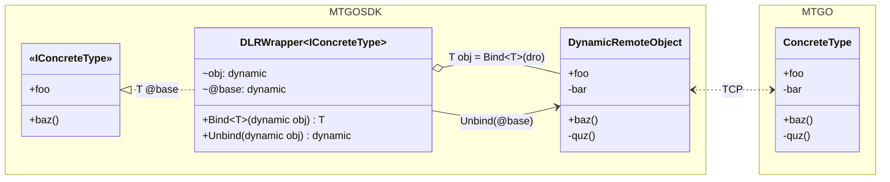

# MTGOSDK.Core.Reflection.DLRWrapper

The [`DLRWrapper`](/MTGOSDK/src/Core/Reflection/DLRWrapper.cs) class allows for binding interfaces to a dynamic object in a type-safe manner, hiding dynamic dispatching from constructor calls and allowing for the use of interfaces in a dynamic context. This eagerly caches the public members of the dynamic object behind the interface, preventing access to any members that are not declared in the interface type.

Below is a UML class diagram of a DLRWrapper class that binds an interface IConcreteType to a dynamic remote object (dro) that wraps a remote ConcreteType object; we'll omit ClrMD remoting details for brevity.



The `Bind<T>()` and `Unbind()` methods are used to bind and unbind the dynamic object to the DLRWrapper's interface type. At runtime, this generates an assembly that wraps the members of the interface to members of the dynamic object, allowing for type-safe access to the dynamic object's members at both compile-time and runtime.

The `obj` property is the dynamic object that the DLRWrapper is bound to, which the class exposes through a `@base` property; this distinction is made so that if the object is another DLRWrapper then the `@base` property will return the original object. Essentially, the `@base` property is the getter for the `obj` property, and the `obj` property is the setter for the `@base` property.

## Type Binding and Unbinding

We can observe this dynamic by creating a DLRWrapper class that binds an interface IBar to a dynamic object bar that wraps a Bar object. The DLRWrapper class will only expose the members of the IBar interface to the `@base` property, creating a compile-time error if we try to access any members that are not declared in the interface.

```C#
public interface IBar
{
  int A;
  string B;
}

public class Bar : IBar
{
  public int A { get; set; }
  public string B { get; private set; }
  private string C { get; set; }
}
```

```C#
using MTGOSDK.Core.Reflection; // DLRWrapper<I>

public class Foo(dynamic bar) : DLRWrapper<Bar>
{
  internal override IBar obj => Bind<IBar>(bar); // Bind IBar to the object.

  public int    A => @base.A;
  public string B => @base.B;
  public string C =>
    @base.C;         // Error: 'IBar' does not contain a definition for 'C'

  public void SetC(string value) =>
    @base.C = value; // Error: 'IBar' does not contain a definition for 'C'
}
```

To access members of the dynamic object that are not declared in the interface, we can unbind the dynamic object at the expense of compile-time type checking and access the members directly. We can revise the Foo class to unbind the dynamic object before getting or setting the value for `Bar.C`, as shown in the following example.

```C#
using MTGOSDK.Core.Reflection; // DLRWrapper<I>

public class Foo(dynamic bar) : DLRWrapper<Bar>
{
  internal override IBar obj => Bind<IBar>(bar); // Bind IBar to the object.

  public int    A => @base.A;
  public string B => @base.B;
  public string C =>
    Unbind(@base).C;

  public void SetC(string value) =>
    Unbind(@base).C = value;
}
```

Additionally, if we were to bind an interface to another dynamic object in the class, we can use the interface as the type for the dynamic object. We can see this in the following example, which encapsulates the dynamic object in roughly the same way as the previous example using a static class.

```C#
using static MTGOSDK.Core.Reflection.DLRWrapper;

public static class Foo
{
  private static dynamic bar = GetBar(); // Placeholder for demo purposes.
  private static IBar barObj = Bind<IBar>(bar);

  public static int    A => barObj.A;
  public static string B => barObj.B;
  public static string C =>
    Unbind(barObj).C;

  public static void SetC(string value) =>
    Unbind(barObj).C = value;

  // New Baz wrapper properties

  private static dynamic baz = Unbind(barObj).baz;
  private static IBaz bazObj = Bind<IBaz>(baz);

  public static string D => bazObj.D;
  public static string E =>
    Unbind(bazObj).D;

  public static void SetE(string value) =>
    Unbind(bazObj).E = value;
}
```

Here the `GetBar()` method is a placeholder for a method that retrieves the dynamic object from a remote source, such as [`ObjectProvider.Get<T>`](./object-provider.md) or [`RemoteClient.GetInstance()`](./remote-client.md). In this example we assume that the **baz** object is another class that implements the `IBaz` interface, which is bound to the **bar** dynamic object behind the **baz** property.

If the **baz** property is present in the `IBar` interface, we can simply access it and specity it's type as `IBaz` without any additional binding. This will allow us to access the public members of the **baz** object in the same way as the **bar** object.

```C#
using MTGOSDK.Core.Reflection; // DLRWrapper<I>

public class Foo(dynamic bar) : DLRWrapper<Bar>
{
  private IBar barObj => Bind<IBar>(bar); // Bind IBar to the object.

  public int    A => barObj.A;
  public string B => barObj.B;
  public string C =>
    Unbind(barObj).C;

  public void SetC(string value) =>
    Unbind(barObj).C = value;

  private IBaz bazObj => barObj.baz; // The IBaz interface is already bound.

  public string D => bazObj.D;
  public string E =>
    Unbind(bazObj).D;

  public void SetE(string value) =>
    Unbind(bazObj).E = value;
}
```

We can observe that only the first call to `Bind<T>()` is necessary to box the dynamic object behind the interface type, and that subsequent calls to `Unbind()` will unbox the dynamic object to access all of its members. Multiple calls to `Bind<T>()` will not create multiple instances of the dynamic object, but will instead return the same instance of the dynamic object that is boxed behind the interface type.

## Remarks

When possible, it is best to limit the use of unbound dynamic objects and instead prefer binding interfaces as early as possible to benefit from type checking. This will help prevent runtime exceptions and make static code analysis tools -- such as ILLink for application trimming -- more predictable and reliable.
