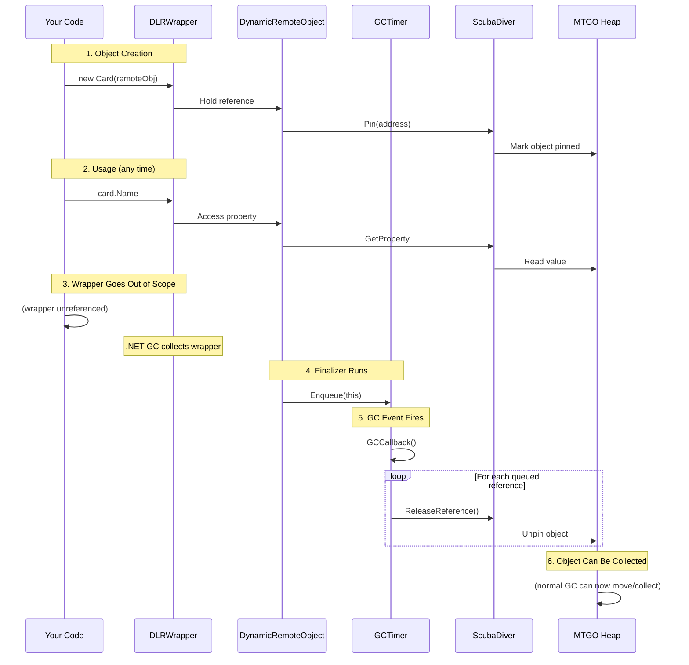

# Memory Management

This document explains how the SDK coordinates garbage collection between your application and the MTGO process, ensuring remote object references are properly cleaned up without causing memory leaks or premature collection.

## The Problem: Cross-Process Object Lifetimes

When the SDK accesses an object in MTGO's memory, ScubaDiver "pins" that object to prevent MTGO's garbage collector from moving or collecting it. This pinning is necessary because the SDK holds a reference by memory address. If MTGO's GC moved the object, the address would become invalid.

But pinning creates two problems:

1. **Memory fragmentation**: Pinned objects can't be compacted, fragmenting MTGO's heap over time
2. **Memory leaks**: If your code stops referencing an SDK wrapper without telling ScubaDiver, the object stays pinned indefinitely

The .NET garbage collector doesn't notify you when objects are collected. There's no "destructor" or cleanup hook that fires reliably when a reference dies. The SDK needs a way to detect when wrapper objects are no longer referenced and unpin their remote objects.

`GCTimer` solves this by monitoring garbage collection events and coordinating cleanup.

---

## GCTimer Architecture

`GCTimer` is a static class that manages a queue of remote object references to unpin:

```csharp
public static class GCTimer
{
  // Objects waiting for cleanup
  private static readonly ConcurrentQueue<IObjectReference> s_objQueue = new();
  
  // GC notification state
  private static bool s_gcNotificationsAvailable = false;
  private static bool s_noGCRegionActive = false;
  private static readonly ReaderWriterLockSlim s_gcRegionLock = new();
  
  // Fallback timer
  private static Timer s_timer;
  private static readonly CancellationTokenSource s_gcListenerCts = new();
  private static readonly Task s_gcListenerTask;
}
```

The queue holds `IObjectReference` instances, an interface that provides reference counting semantics:

```csharp
public interface IObjectReference
{
  bool IsValid { get; }
  void ReleaseReference(bool immediate);
}
```

When a wrapper object's finalizer runs, it enqueues its remote object reference. The next GC cycle (or timer tick) processes the queue and tells ScubaDiver to unpin.

---

## GC Notification Approach

The preferred approach uses .NET's GC notification API:

```csharp
static GCTimer()
{
  try
  {
    // Register for full GC notifications at 80% threshold
    GC.RegisterForFullGCNotification(80, 80);
    s_gcNotificationsAvailable = true;
    
    // Start background listener
    s_gcListenerTask = Task.Factory.StartNew(
      GCListenerLoop,
      s_gcListenerCts.Token,
      TaskCreationOptions.LongRunning,
      TaskScheduler.Default
    ).Unwrap();
  }
  catch
  {
    // Fallback if registration fails
    UnsubscribeFromGCNotifications();
  }
}
```

The listener loop waits for GC events:

```csharp
private static async Task GCListenerLoop()
{
  while (!s_gcListenerCts.Token.IsCancellationRequested)
  {
    // Wait for GC to approach (1 second timeout)
    var status = GC.WaitForFullGCApproach(1000);
    
    if (status == GCNotificationStatus.Succeeded)
    {
      // Wait for GC to complete
      GC.WaitForFullGCComplete();
      
      // Process cleanup queue
      GCCallback(null);
    }
    
    // Brief delay before checking again
    await Task.Delay(1000, s_gcListenerCts.Token).ConfigureAwait(false);
  }
}
```

### Why GC Notifications?

Tying cleanup to actual GC events has advantages:

1. **Timely cleanup**: References are released soon after the local wrapper is collected
2. **Batch processing**: Multiple finalizers may run before the notification, allowing bulk cleanup
3. **Low overhead**: No polling when GC isn't happening

The 80% threshold means we get notified when 80% of GC heap budget is used, which typically precedes a full collection.

### Timer Fallback

GC notifications aren't always available:
- Server GC configurations may not support them
- Some hosting environments disable them
- Registration can fail for various reasons

When unavailable, `GCTimer` falls back to a periodic timer:

```csharp
public static void UnsubscribeFromGCNotifications()
{
  if (s_gcNotificationsAvailable)
  {
    GC.CancelFullGCNotification();
    s_gcNotificationsAvailable = false;
    s_gcListenerCts.Cancel();
    
    // Start 30-second cleanup timer
    s_timer = new Timer(GCCallback, null, Timeout.Infinite, Timeout.Infinite);
  }
}
```

The timer isn't as timely as GC notifications, but ensures cleanup happens eventually.

---

## The Cleanup Queue

When a wrapper finalizer runs, it enqueues its reference:

```csharp
public static void Enqueue(IObjectReference objRef)
{
  if (objRef == null || !objRef.IsValid)
    return;

  s_objQueue.Enqueue(objRef);
}
```

The callback processes all queued references:

```csharp
private static void GCCallback(object? state)
{
  while (s_objQueue.TryDequeue(out IObjectReference objRef))
  {
    // Tell ScubaDiver to unpin this object
    objRef?.ReleaseReference(false);
  }
}
```

This is a fire-and-forget dequeue: process everything available, then return. The next GC cycle will handle anything enqueued during processing.

---

## No-GC Regions

For performance-critical operations, you may want to prevent GC entirely. `GCTimer` provides a scope for this:

```csharp
public static IDisposable SuppressGC() => new GCTimerPause();

public sealed class GCTimerPause : IDisposable
{
  public GCTimerPause() => Stop();

  public void Dispose()
  {
    Stop();
    GC.SuppressFinalize(this);
  }
}
```

Usage:

```csharp
using (GCTimer.SuppressGC())
{
  // GC won't run during this block
  foreach (var card in collection.Items)
  {
    ProcessCard(card); // All remote objects stay pinned
  }
}
// GC can run again
```

### How No-GC Regions Work

The SDK uses `GC.TryStartNoGCRegion`:

```csharp
public static void Stop()
{
  s_gcRegionLock.EnterUpgradeableReadLock();
  try
  {
    if (!s_noGCRegionActive)
    {
      s_gcRegionLock.EnterWriteLock();
      try
      {
        if (!s_noGCRegionActive &&
            Try(() => GC.TryStartNoGCRegion(128 * 1024 * 1024)))  // 128MB
        {
          s_noGCRegionActive = true;
        }
      }
      finally { s_gcRegionLock.ExitWriteLock(); }
    }
  }
  finally { s_gcRegionLock.ExitUpgradeableReadLock(); }

  // Also pause GC notifications/timer
  if (s_gcNotificationsAvailable)
  {
    s_gcListenerCts.Cancel();
  }
  s_timer?.Change(Timeout.Infinite, Timeout.Infinite);
}
```

The no-GC region requests 128MB of heap space without GC. Allocations within this budget proceed without triggering collection. If the budget is exceeded, the region ends automatically.

### Lock Strategy

The `ReaderWriterLockSlim` protects the no-GC region state:
- Multiple reads (checking `s_noGCRegionActive`) can happen concurrently
- Writes (starting/ending region) are exclusive
- The upgradeable pattern allows optimistic reads before write

This is important because multiple threads might try to enter no-GC regions simultaneously.

---

## DLRWrapper Integration

`DLRWrapper` integrates with `GCTimer` through its finalizer and reference holding:

```csharp
internal override dynamic @base
{
  get
  {
    if (field == null)
    {
      field = Try(() => obj is DLRWrapper<I> ? obj.obj : obj);
      
      // Keep strong reference to prevent premature GC
      if (field != null && @base_unbound == null)
      {
        @base_unbound = Try(() => Unbind(field), () => field);
      }
    }
    
    return field ?? throw new ArgumentException(...);
  }
}
```

The `@base_unbound` field holds a strong reference to the underlying `DynamicRemoteObject`. This prevents .NET from finalizing the remote object while the wrapper is still alive.

When the wrapper is collected, its finalizer enqueues the remote object reference:

```csharp
// In DynamicRemoteObject
~DynamicRemoteObject()
{
  GCTimer.Enqueue(this);
}
```

This deferred cleanup ensures the ScubaDiver unpin happens during a known-safe point (GC callback) rather than during finalization, which has restrictions.

---

## Reference Lifecycle Diagram



---

## Why This Matters

Without proper cleanup:

| Problem | Effect |
|---------|--------|
| Orphaned pins | MTGO memory grows, can't be compacted |
| Fragmentation | GC becomes slower, more frequent |
| Memory pressure | MTGO may run out of heap space |
| Degraded performance | Long-running apps become sluggish |

With `GCTimer`:

| Behavior | Benefit |
|----------|---------|
| Automatic cleanup | References released when wrappers collected |
| Batch processing | Efficient bulk unpinning |
| Deferred release | Safe point for cross-process communication |
| No manual disposal | Fire-and-forget for most code |

---

## Manual Cleanup

While automatic cleanup handles most cases, you can force cleanup:

```csharp
// Clear event subscriptions (removes SDK-side references)
game.ClearEvents();

// Force GC and process queue immediately
GC.Collect();
GC.WaitForPendingFinalizers();
```

This is rarely needed. Consider it for:
- Explicit resource release before a long operation
- Testing cleanup behavior
- Debugging memory issues

---

## Debugging Memory Issues

If you suspect memory leaks:

1. **Check event subscriptions**: Uncleared event handlers keep objects alive
2. **Look for static references**: Static fields holding wrappers prevent collection
3. **Monitor MTGO memory**: Use Task Manager to watch MTGO's working set
4. **Force GC**: Call `GC.Collect()` to test if cleanup is working

The SDK logs cleanup activity at Debug level, which can help diagnose issues.

---

## See Also

- [DLR Wrapper](./dlr-wrapper.md) - How wrappers manage object references
- [Remote Client](./remote-client.md) - Object pinning at the IPC level
- [Threading](./threading.md) - Background thread coordination
