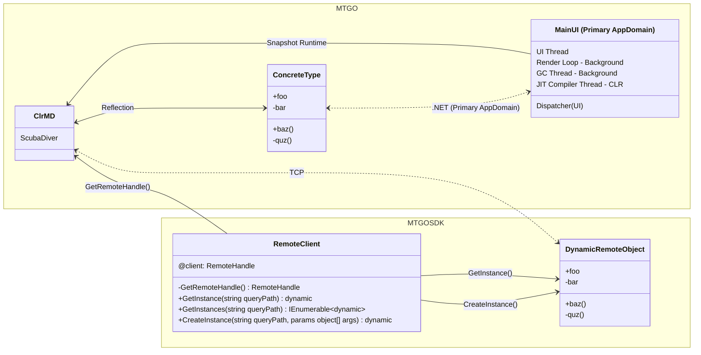

# MTGOSDK.Core.Remoting.RemoteClient

The [`RemoteClient`](/MTGOSDK/src/Core/Remoting/RemoteClient.cs) class is a static class that manages the connection to the MTGO client, providing a way to access remote objects in client memory. This class is used to bootstrap a connection to the MTGO client and create DynamicRemoteObject instances that can be used to proxy interactions with remote objects.

Below is a UML diagram of the RemoteClient class, which contains methods for creating, retrieving, and invoking remote objects. For now, we'll focus only on a subset of APIs for fetching and creating remote objects.



Here we use the RemoteClient to inject ClrMD into the MTGO process, allowing us to start the Snapshot Runtime to locate and interact with remote objects using reflection. The corresponding DynamicRemoteObject class is used to proxy interactions with remote objects, providing a way to interact with objects between processes.

## Fetching Remote Objects

With the `GetInstance()` method, we can create a dynamic object that fetches a remote object in the client's heap memory. This method takes a string parameter that represents the fully qualified name of the object to be created, and returns a dynamic object that can be used to interact with the remote object.

We can do so using any of the following methods:

```C#
using MTGOSDK.Core.Reflection; // TypeProxy<T>
using MTGOSDK.Core.Remoting;   // RemoteClient

dynamic objB = RemoteClient.GetInstance(new TypeProxy<Bar>());
dynamic objC = RemoteClient.GetInstance(new TypeProxy<dynamic>(typeof(Bar)));
dynamic objA = RemoteClient.GetInstance("assembly.namespace.Bar");
```

> [!NOTE]
> Objects returned this way must be handled as dynamic objects, which defer type checking to runtime. Refer to the [`DLRWrapper`](./dlr-wrapper.md) class for a way to bind interfaces to dynamic objects in a type-safe manner.

Additionally, multiple instances of the object can be found by using `GetInstances()`, returning an enumerable collection of dynamic objects that represent the remote objects in the client's memory space.

```C#
using MTGOSDK.Core.Reflection.Proxy; // TypeProxy<T>
using MTGOSDK.Core.Remoting;         // RemoteClient

foreach (dynamic obj in RemoteClient.GetInstances("assembly.namespace.Bar"))
{
  // Do something with obj.
}
```

## Creating Remote Objects

Creating a new instance of a remote object is similarly straightforward, using the `CreateInstance()` method to invoke the object's constructor with the specified arguments. This method takes a string parameter that represents the fully qualified name of the object to be created, and an array of objects that represent the arguments to be passed to the constructor.

Below is an example of creating a new instance of a remote object with the `CreateInstance()` method, using the [`TypeProxy<T>`](/MTGOSDK/src/Core/Reflection/Proxy.cs) class to convert the interface type to a string containing the fully qualified name of the object. We'll assume that the `Bar` class has two constructors, one with two arguments and the other with three arguments.

```C#
class Bar : IDisposable
{
  public Bar(int A, string B) { }
  public Bar(int A, string B, string C) { }
  public void Dispose() { }
}
```

```C#
using MTGOSDK.Core.Reflection.Proxy; // TypeProxy<T>
using MTGOSDK.Core.Remoting;         // RemoteClient

// Invoke the first constructor with 2 arguments (A and B).
dynamic objA = RemoteClient.CreateInstance<Bar>(1, "foo");
// Invoke the second constructor with 3 arguments (A, B, and C).
dynamic objB = RemoteClient.CreateInstance<Bar>(2, "bar", "baz");

// Invoke the first constructor and dispose of the object when out of scope.
using (dynamic objC = RemoteClient.CreateInstance<Bar>(1, "quz"))
{
  // Do something with objC.
}
```

You can also use `RemoteClient.CreateInstance("Foo.Bar", 1, "foo")` to create a new instance of a remote object with the `CreateInstance()` method, using the fully qualified name of the object to be created.

## Remarks

As the `RemoteClient` class is a low-level class that interacts directly with the client's memory space, it is best to limit frequent use of the `RemoteClient` class to cases where the `MTGOSDK.API` classes are not sufficient. Each method in the `RemoteClient` class may traverse the client's memory heap or require reflection to retrieve or interact with objects, which can be slow and resource-intensive.

As such, it is recommended to use the `MTGOSDK.API` classes or the `ObjectProvider` class instead where possible, as these classes provide a safer and more optimized code-path for interacting with remote objects in the client's memory space.
