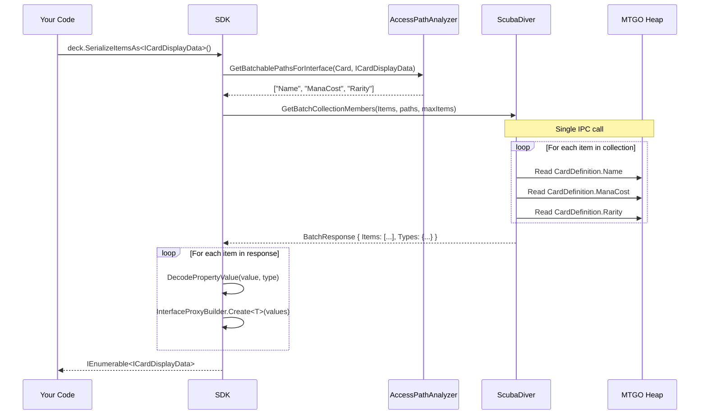

# Serialization

This document explains the SDK's batch serialization system in depth, covering both why it exists and how it works internally. Batch serialization is one of the most important performance optimizations in the SDK, and understanding it helps you write efficient code.

## The Problem: Per-Property IPC Overhead

Every property access on a remote object requires an IPC call to the MTGO process. Here's what happens when you access a single property:

1. Your code calls `card.Name`
2. The `DLRWrapper` routes this through `@base.Name`
3. The bound proxy sends a request to ScubaDiver via TCP
4. ScubaDiver reads the property from MTGO's heap
5. The value is serialized and sent back
6. Your code receives the string

This round-trip takes roughly 1-5ms depending on property type and system load. For a single property, that's imperceptible. But when iterating a collection and accessing multiple properties per item, it multiplies:

```csharp
// Naive approach: 3 IPC calls per card
foreach (var card in deck.Items)  // deck has 60 cards
{
  Console.WriteLine($"{card.Name} - {card.ManaCost} - {card.Rarity}");
  // Each property access = 1 IPC call
  // 60 cards × 3 properties = 180 IPC calls
  // At 3ms each = 540ms minimum
}
```

For a 60-card deck accessing 3 properties each, that's 180 separate IPC round-trips. With typical latency, this takes 500ms to 2 seconds. Accessing more properties makes it proportionally worse.

The fundamental issue is that the SDK doesn't know what properties you'll access next, so it can't prefetch them. Each property access is independent.

---

## The Solution: Interface-Driven Batch Fetching

The `SerializeItemsAs<T>` method flips the model: you declare upfront what properties you need via an interface, and the SDK fetches them all in a single IPC call.

```csharp
// Define an interface with the properties you need
public interface ICardDisplayData
{
  string Name { get; }
  string ManaCost { get; }
  string Rarity { get; }
}

// Single IPC call fetches all properties for all cards
var cards = deck.SerializeItemsAs<ICardDisplayData>().ToList();

// Now iteration is pure local memory access
foreach (var card in cards)
{
  Console.WriteLine($"{card.Name} - {card.ManaCost} - {card.Rarity}");
  // No IPC calls here - data is already local
}
```

The returned objects are lightweight proxies containing pre-fetched data. All property accesses are local memory reads with zero IPC overhead.

---

## How It Works Internally

The batch serialization system involves several components working together. Here's the detailed flow:

### Step 1: Path Analysis

When you call `SerializeItemsAs<T>()`, the SDK first analyzes your interface to determine what remote properties to fetch:

```csharp
var prefixedPaths = Serialization.AccessPathAnalyzer.GetBatchablePathsForInterface(
  typeof(TPathSource), interfaceType);
```

`AccessPathAnalyzer` inspects the interface properties and maps them to property paths on the wrapper class. For example, if your interface has `string Name { get; }`, it maps to the remote path "Name" on the Card wrapper.

The analyzer only includes "batchable" properties, meaning primitive types and simple value types that can be serialized. Complex nested objects (like `PlayFormat`) are excluded because they require their own wrapper instantiation.

### Step 2: Collection Access and Path Building

The SDK accesses the remote collection and builds the full property path list:

```csharp
// Build full paths with any required prefixes
var paths = new List<string>();
foreach (var path in prefixedPaths)
{
  paths.Add(string.IsNullOrEmpty(pathPrefix) 
    ? path 
    : $"{pathPrefix}.{path}");
}
```

For deck items, the path prefix is "CardDefinition" because deck items store card data in a `CardDefinition` property. So `Name` becomes `CardDefinition.Name` in the batch request.

### Step 3: Single Batch IPC Call

The SDK sends one request to ScubaDiver asking for all properties on all items:

```csharp
var response = RemoteClient.@client.Communicator.GetBatchCollectionMembers(
  dro.__ro.RemoteToken,          // Remote collection address
  dro.__type?.FullName,          // Collection type name
  string.Join("|", paths),       // Pipe-delimited property paths
  maxItems                       // Optional limit
);
```

The `GetBatchCollectionMembers` method is the key. It tells ScubaDiver: "For this collection, iterate all items and fetch these properties from each one, returning everything in a single response."

ScubaDiver performs the iteration and property access inside the MTGO process, serializing all values into a structured response. This moves the loop from your process (with IPC per iteration) to the target process (with local access per iteration).

### Step 4: Response Decoding

The response contains encoded property values for each item. The SDK decodes them based on type information:

```csharp
foreach (var itemData in response.Items)
{
  var propertyValues = new Dictionary<string, object?>();
  
  foreach (var kvp in itemData)
  {
    // Remove prefix to get interface property path
    var propPath = kvp.Key.StartsWith(pathPrefix + ".") 
      ? kvp.Key.Substring(pathPrefix.Length + 1) 
      : kvp.Key;

    // Decode based on type
    var typeName = response.Types?.TryGetValue(kvp.Key, out var t) == true ? t : null;
    var value = DecodePropertyValue(kvp.Value, typeName);
    
    propertyValues[propPath] = value;
  }
  
  // Build proxy object
  yield return InterfaceProxyBuilder.Create<TInterface>(propertyValues);
}
```

The `DecodePropertyValue` method handles different value types:
- Primitives (string, int, bool) are decoded using `PrimitivesEncoder.Decode`
- JSON arrays are deserialized to `List<string>` or `List<object>`
- Null and empty values are preserved

### Step 5: Proxy Object Creation

Finally, `InterfaceProxyBuilder.Create<T>()` generates a lightweight object implementing your interface, backed by the decoded property dictionary:

```csharp
// Conceptually, the generated proxy looks like:
class CardDisplayDataProxy : ICardDisplayData
{
  private readonly Dictionary<string, object?> _values;
  
  public string Name => (string)_values["Name"];
  public string ManaCost => (string)_values["ManaCost"];
  public string Rarity => (string)_values["Rarity"];
}
```

The actual implementation uses reflection emit to generate these proxies at runtime, caching them per interface type.

---

## The Sequence in Pictures



---

## Interface Design Guidelines

Your serialization interface must match properties on the SDK wrapper class (`Card`, `Deck`, etc.), not internal MTGO types:

```csharp
// CORRECT: These match Card wrapper properties
public interface ICardSortData
{
  string Name { get; }           // Card.Name exists
  int ConvertedManaCost { get; } // Card.ConvertedManaCost exists
  string Rarity { get; }         // Card.Rarity exists
  string ManaCost { get; }       // Card.ManaCost exists
  IList<string> Types { get; }   // Card.Types exists (as IList<string>)
}

// INCORRECT: Internal MTGO fields don't work
public interface IBadInterface
{
  string m_name { get; }           // Internal field, not exposed
  int catalogId { get; }           // Wrong casing (should be CatalogId)
  PlayFormat Format { get; }       // Complex type, not batchable
}
```

### What's Batchable?

Only primitive and simple types can be batch-fetched:

| Type | Batchable | Notes |
|------|-----------|-------|
| `string` | Yes | |
| `int`, `long`, `double` | Yes | |
| `bool` | Yes | |
| `DateTime` | Yes | Serialized as ticks |
| `IList<string>` | Yes | JSON array |
| `PlayFormat` | No | Complex wrapper type |
| `Set` | No | Complex wrapper type |
| Nested objects | No | Require separate wrapper |

Complex types are excluded because they need their own `DLRWrapper` instantiation, which can't happen in the batch response. If you need complex properties, access them individually after batch-fetching the primitives.

### Keep Interfaces Minimal

Each property you add increases response size and decode time. Only include what you actually need:

```csharp
// Good: Just what you need for sorting
public interface ICardSortData
{
  string Name { get; }
  int ConvertedManaCost { get; }
}

// Wasteful: Fetching unnecessary properties
public interface ICardEverything
{
  string Name { get; }
  int ConvertedManaCost { get; }
  string ManaCost { get; }
  string Rarity { get; }
  string RulesText { get; }        // Not needed for sorting
  string FlavorText { get; }       // Not needed for sorting
  IList<string> Types { get; }     // Not needed for sorting
  IList<string> Subtypes { get; }  // Not needed for sorting
}
```

---

## Single-Object Hydration

For a single wrapper instance (rather than a collection), use `HydrateForInterface<T>()`:

```csharp
// Inside a wrapper class, hydrate for specific interface
internal void HydrateForInterface<TInterface>(string[] paths)
{
  // Single IPC call for this object's properties
  var response = RemoteClient.@client.Communicator.GetBatchMembers(
    dro.__ro.RemoteToken,
    dro.__type?.FullName,
    string.Join("|", paths));

  // Store decoded values in caching proxy
  _interfaceProxies[interfaceType] = new CachingRemoteProxy(remoteObj, values);
}
```

After hydration, subsequent property accesses for that interface hit the cache instead of making IPC calls. The `@base` property automatically returns the caching proxy when one exists.

---

## Frozen Collections: The Fastest Path

For very large collections where you only need basic identification, `GetFrozenCollection` is even faster than batch serialization:

```csharp
var snapshot = collection.GetFrozenCollection.ToArray();
```

This works by parsing the collection's debug string representation:

```csharp
[GeneratedRegex(@"^\s*-\s*Qty:\s*(\d+)\s*Id:\s*(\d+)\s*Name:\s*(.*)$")]
private static partial Regex ParseQuantitiesAndIdsRegex();

public IList<CardQuantityPair> GetFrozenCollection =>
  Map<IList, CardQuantityPair>(
    ParseItems(@base.DebugData()),
    Lambda(item => new CardQuantityPair(item.Item1, item.Item2, item.Item3)));
```

MTGO's debug data format includes quantity, ID, and name for each item. Regex parsing extracts these without invoking any property accessors on individual items. The result is a collection of partial `CardQuantityPair` objects with just these three fields populated.

Use frozen collections when:
- You're processing thousands of items
- You only need ID, quantity, and name
- You can fetch detailed card data later on demand

---

## Performance Comparison

For a 60-card deck accessing 5 properties per card:

| Approach | IPC Calls | Typical Time | Memory |
|----------|-----------|--------------|--------|
| Direct property access | 300 | 2-5 seconds | Minimal |
| SerializeItemsAs | 1 | 100-300ms | ~10KB response |
| GetFrozenCollection | 1 | 10-50ms | Debug string |

The batch approach is 10-20x faster than direct access. Frozen collections are faster still but provide less data.

For very large collections (1000+ items), batch serialization can take 500ms+ due to response size. Consider:
- Using `maxItems` parameter to limit results
- Processing in chunks
- Using frozen collection with on-demand detail fetch

---

## See Also

- [DLR Wrapper](./dlr-wrapper.md) - How `Bind<T>` and `@base` work
- [Remote Client](./remote-client.md) - IPC communication layer
- [Type Compilation](./type-compilation.md) - How interface proxies are built
