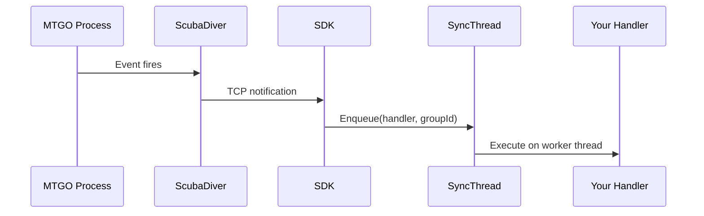

# Threading

This document explains the SDK's threading model in depth, covering how it manages background work, avoids blocking MTGO's UI thread, and ensures related operations execute in order.

## Why Threading Matters

The SDK performs many IPC calls to the MTGO process: reading properties, invoking methods, and handling events. If these calls execute on MTGO's UI thread, they block the client until completion, causing the client to freeze or become unresponsive.

MTGO, like most WPF applications, has a single UI thread (the dispatcher thread) that handles all user input and screen updates. Any long-running work on this thread makes the application feel sluggish. IPC calls can take 1-50ms each, and event handlers often access multiple properties, so blocking adds up quickly.

The SDK routes all its work through dedicated background threads managed by `SyncThread`. This keeps MTGO responsive while your code does its work.

---

## The SyncThread Class

`SyncThread` is a static class that manages a custom thread pool for SDK operations. It provides two main patterns: fire-and-forget enqueueing and awaitable async enqueueing.

### Thread Pool Configuration

The pool sizes are based on processor count:

```csharp
// Minimum threads: max(4, processor count)
private static readonly int s_minJobThreads = Math.Max(4, Environment.ProcessorCount);

// Maximum threads: processor count * 2
private static readonly int s_maxJobThreads = Environment.ProcessorCount * 2;

private static readonly ConcurrentTaskScheduler s_taskScheduler =
  new(s_minJobThreads, s_maxJobThreads, s_cancellationToken);
```

On a quad-core machine, this means 4-8 threads. On an 8-core machine, 8-16 threads. The pool scales dynamically based on demand, creating threads when work is queued and reclaiming idle threads over time.

The custom `ConcurrentTaskScheduler` wraps the thread pool logic, handling work item queuing, thread lifecycle, and cancellation propagation.

### Fire-and-Forget: Enqueue

For operations where you don't need to wait for completion:

```csharp
SyncThread.Enqueue(() =>
{
  // This runs on a background thread
  var decks = CollectionManager.Decks.ToList();
  Console.WriteLine($"Found {decks.Count} decks");
});

// Execution continues immediately - doesn't wait
```

The callback is wrapped with exception handling:

```csharp
private static Action WrapCallback(Action callback) => () =>
{
  if (s_cancellationToken.IsCancellationRequested) return;

  try
  {
    callback();
  }
  catch (Exception ex)
  {
    Log.Error(ex, "An error occurred while executing a callback.");
    Log.Debug(ex.StackTrace);

    // Log all inner exceptions
    while (ex.InnerException != null)
    {
      Log.Error(ex.InnerException, "Inner exception: {0}", 
        ex.InnerException.Message + "\n" + ex.InnerException.StackTrace);
      ex = ex.InnerException;
    }
  }
};
```

Exceptions are caught, logged, and swallowed rather than propagating to your code. This prevents background thread crashes from taking down your application. If you need to handle errors, use the async version instead.

### Awaitable: EnqueueAsync

When you need to wait for completion or handle errors:

```csharp
await SyncThread.EnqueueAsync(async () =>
{
  var replay = await ReplayManager.RequestReplay(gameId);
  if (replay == null)
    throw new InvalidOperationException("Failed to start replay");
  // Process replay...
});
```

The implementation handles task unwrapping correctly:

```csharp
public static async Task EnqueueAsync(Func<Task> callback, TimeSpan? timeout = null)
{
  if (s_cancellationToken.IsCancellationRequested)
    return;

  // IMPORTANT: StartNew with async Func<Task> returns Task<Task>.
  // Must Unwrap() to await the inner async work, not just the scheduling.
  await s_taskFactory.StartNew(WrapCallbackAsync(callback), s_cancellationToken)
    .Unwrap();
}
```

The `Unwrap()` call is critical. Without it, your `await` would return as soon as the callback is scheduled, not when it completes. The unwrap ensures you wait for the actual async work.

---

## Group-Based Ordering

Some operations must execute in a specific order. For example, when processing game events, zone changes should be processed before life total changes for that same game action, even if they're raised as separate events.

`SyncThread` supports group IDs that force operations with the same ID to execute sequentially:

```csharp
string gameId = game.Id.ToString();

// These execute in order, even if enqueued rapidly
game.OnZoneChange += (card) =>
{
  SyncThread.Enqueue(() => ProcessZoneChange(card), gameId);
};

game.OnLifeChange += (player) =>
{
  SyncThread.Enqueue(() => ProcessLifeChange(player), gameId);
};

game.CurrentTurnChanged += (args) =>
{
  SyncThread.Enqueue(() => ProcessTurnStart(args.Game), gameId);
};
```

### How Grouping Works

The implementation chains tasks as continuations:

```csharp
public static void Enqueue(Action callback, string groupId)
{
  if (string.IsNullOrEmpty(groupId))
  {
    // Fall back to non-grouped (parallel) execution
    Enqueue(callback);
    return;
  }

  Task newTask;
  if (s_groupTasks.TryGetValue(groupId, out var existingTask) &&
      !existingTask.IsCompleted && !existingTask.IsFaulted && !existingTask.IsCanceled)
  {
    // Continue from previous task in this group to ensure order
    newTask = existingTask.ContinueWith(
      _ => WrapCallback(callback)(),
      s_cancellationToken,
      TaskContinuationOptions.None,
      s_taskScheduler);
  }
  else
  {
    // No existing task for this group - start fresh
    newTask = s_taskFactory.StartNew(WrapCallback(callback), s_cancellationToken);
  }

  // Track the latest task for this group
  s_groupTasks[groupId] = newTask;
}
```

When you enqueue with a group ID, the SDK checks if there's already a pending task for that group. If so, the new callback becomes a continuation of the existing task, ensuring it waits for the previous callback to complete. If not, it starts a new task chain.

The `s_groupTasks` dictionary maps group IDs to their latest task. This forms a chain: task A → task B → task C, where each waits for its predecessor.

### Parallel + Ordered

Operations with different group IDs (or no group ID) execute in parallel:

```csharp
// Game 1 events process sequentially with each other
SyncThread.Enqueue(() => ProcessGame1Event(), "game-123");
SyncThread.Enqueue(() => ProcessGame1Event(), "game-123");

// Game 2 events process sequentially with each other
SyncThread.Enqueue(() => ProcessGame2Event(), "game-456");

// But Game 1 and Game 2 process in parallel!
```

This is how the SDK handles multiple simultaneous games: each game's events stay ordered relative to themselves, but games don't block each other.

### Group Cleanup

Completed tasks are cleaned up by a background timer:

```csharp
private static readonly Timer s_cleanupTimer;
private static readonly TimeSpan s_cleanupInterval = TimeSpan.FromSeconds(30);

private static void CleanupCallback(object? state)
{
  foreach (var key in s_groupTasks.Keys.ToList())
  {
    if (s_groupTasks.TryGetValue(key, out var task) &&
        (task.IsCompleted || task.IsCanceled || task.IsFaulted))
    {
      s_groupTasks.TryRemove(key, out _);
    }
  }
}
```

Every 30 seconds, the cleanup timer removes completed task entries from the dictionary. This prevents unbounded growth when you use many different group IDs over time.

---

## Cancellation and Shutdown

`SyncThread` uses a `CancellationTokenSource` for graceful shutdown:

```csharp
private static readonly CancellationTokenSource s_cancellationTokenSource = new();
private static readonly CancellationToken s_cancellationToken = 
  s_cancellationTokenSource.Token;

public static void Stop()
{
  s_cancellationTokenSource.Cancel();
  s_cleanupTimer?.Dispose();
}
```

When `Stop()` is called (typically during `Client.Dispose()`):

1. The cancellation token is triggered
2. All pending callbacks check the token and return early if cancelled
3. The cleanup timer is disposed
4. No new work is accepted (new enqueue calls check the token)

Callbacks already running complete normally. The cancellation only affects pending work and prevents new work from starting.

### Token Checking

Callbacks check the token at the start:

```csharp
private static Action WrapCallback(Action callback) => () =>
{
  if (s_cancellationToken.IsCancellationRequested) return;
  // ... rest of callback
};
```

This means callbacks that were queued before `Stop()` but haven't started yet will exit immediately when they do start, without executing their work.

---

## Integration with Event Handlers

The SDK's event system hooks into MTGO's events on the MTGO process's threads. When an event fires, ScubaDiver receives it and sends a notification to your process. The event callback then runs on a `SyncThread` worker:



Your event handlers always run on `SyncThread` workers, never on MTGO's UI thread. This is automatic; you don't need to call `Enqueue` yourself for event handlers. The SDK handles the dispatch.

---

## Best Practices

### Don't Block Inside Callbacks

Even though callbacks run on background threads, blocking operations reduce throughput:

```csharp
// BAD: Synchronous wait inside callback
SyncThread.Enqueue(() =>
{
  Thread.Sleep(5000);  // Blocks a worker thread
  DoWork();
});

// GOOD: Use async version for long waits
await SyncThread.EnqueueAsync(async () =>
{
  await Task.Delay(5000);  // Releases thread during wait
  await DoWorkAsync();
});
```

### Use Group IDs for Related Operations

When operations must execute in order:

```csharp
// Group by the entity they affect
SyncThread.Enqueue(() => UpdatePlayer(player), $"player-{player.Id}");
SyncThread.Enqueue(() => UpdatePlayer(player), $"player-{player.Id}");

// Different players can update in parallel
SyncThread.Enqueue(() => UpdatePlayer(other), $"player-{other.Id}");
```

### Don't Create Too Many Groups

Each unique group ID consumes memory until cleanup runs. If you're creating thousands of groups rapidly, consider reusing IDs or batching operations:

```csharp
// BAD: Unique group per operation
for (int i = 0; i < 10000; i++)
{
  SyncThread.Enqueue(() => Work(), $"work-{Guid.NewGuid()}");
}

// GOOD: Batch or use fewer groups
SyncThread.Enqueue(() =>
{
  for (int i = 0; i < 10000; i++) Work();
});
```

---

## See Also

- [Events](./events.md) - How event callbacks are dispatched
- [Remote Client](./remote-client.md) - IPC communication layer
- [Memory](./memory.md) - GC coordination with threading
