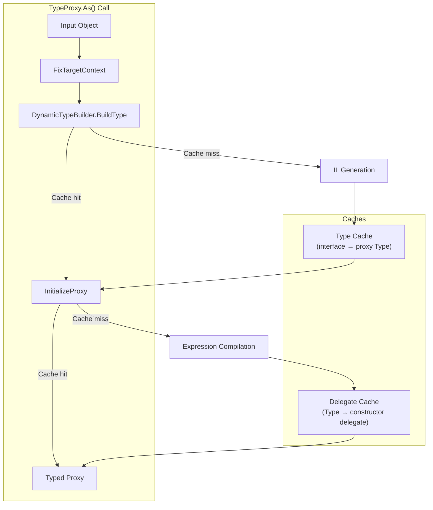

# Type Compilation

This document explains how the SDK generates compiled proxy types at runtime, the internal mechanics of type building, and why compiled proxies dramatically outperform dynamic dispatch.

## The Problem: Dynamic Dispatch Overhead

The SDK accesses objects whose types are only known at runtime. When you call `card.Name`, the SDK needs to route that to the remote object in MTGO's memory. The naive approach uses C#'s `dynamic` keyword:

```csharp
dynamic remoteCard = GetRemoteObject();
string name = remoteCard.Name; // Dynamic dispatch
```

This works, but every access goes through the Dynamic Language Runtime's dispatch mechanism:
1. Look up the member by name
2. Find or create a call site
3. Bind the call site to the target
4. Invoke the member

For hot paths accessed thousands of times, this overhead adds up. The SDK's solution is to generate compiled proxies that map interface methods directly to remote property access, eliminating the dispatch per-call.

---

## TypeProxy Overview

`TypeProxy<T>` is the entry point for proxy generation. It provides methods to bind remote objects to interfaces:

```csharp
// Bind a remote object to a single interface
IDeck proxy = TypeProxy<IDeck>.As(remoteDeckObject);

// Now property access is compiled, not dynamic
string name = proxy.Name; // Direct call, no dispatch lookup
```

### The As Method

The `As` method orchestrates proxy creation:

```csharp
public static T As(object obj)
{
  using var activity = s_activitySource.StartActivity("TypeProxy.As");
  activity?.SetTag("thread.id", Thread.CurrentThread.ManagedThreadId.ToString());
  activity?.SetTag("interface", typeof(T).Name);
  
  // Step 1: Fix the target context (unwrap nested wrappers)
  obj = TypeProxyBuilder.FixTargetContext(obj, out var tContext);
  
  // Step 2: Build (or retrieve cached) proxy type
  var tProxy = DynamicTypeBuilder.BuildType(tContext, typeof(T));

  // Step 3: Create and initialize proxy instance
  var proxy = TypeProxyBuilder.InitializeProxy<T>(tProxy, obj);
  
  // Step 4: Validate the result
  if (!TypeProxyBuilder.IsValidRuntimeType(proxy))
  {
    throw new InvalidOperationException(
      $"The proxy type {proxy.GetType()} is not a valid runtime type.");
  }

  return proxy;
}
```

The method is traced with `ActivitySource` for diagnostics, allowing you to see proxy creation in traces and logs.

### Multi-Interface Binding

You can bind to multiple interfaces at once:

```csharp
public static dynamic As(object obj, params Type[] interfaces)
{
  obj = TypeProxyBuilder.FixTargetContext(obj, out var tContext);
  
  var tProxy = DynamicTypeBuilder.BuildType(
    tContext,
    interfaces.First(),           // Primary interface
    interfaces.Skip(1).ToArray()  // Additional interfaces
  );

  return TypeProxyBuilder.InitializeProxy<T>(tProxy, obj, interfaces);
}
```

The generated proxy implements all specified interfaces, with each interface's properties routed to the underlying remote object.

---

## DynamicTypeBuilder: IL Generation

`DynamicTypeBuilder` handles the actual IL generation. When you request a proxy for an interface it hasn't seen before, it:

1. Creates a new `AssemblyBuilder` and `ModuleBuilder`
2. Defines a new type implementing `IProxy` and your interface
3. Generates IL for a constructor that accepts the target object
4. Generates IL for each property getter that routes to the target

### Conceptual Generated Code

For an interface like:

```csharp
public interface IDeck
{
  string Name { get; }
  int ItemCount { get; }
}
```

The builder generates something equivalent to:

```csharp
internal sealed class DeckProxy_1A2B3C : IDeck, IProxy
{
  private readonly DynamicRemoteObject _target;
  
  public DeckProxy_1A2B3C(object target)
  {
    _target = (DynamicRemoteObject)target;
  }
  
  // IProxy implementation
  public object Original => _target;
  
  // IDeck implementation
  public string Name 
  {
    get => (string)_target["Name"];
  }
  
  public int ItemCount 
  {
    get => (int)_target["ItemCount"];
  }
}
```

The actual implementation uses IL emit directly, not C# source:

```csharp
// Pseudocode for property getter IL
var getMethod = typeBuilder.DefineMethod(
  "get_" + property.Name,
  MethodAttributes.Public | MethodAttributes.Virtual,
  property.PropertyType,
  Type.EmptyTypes);

var il = getMethod.GetILGenerator();
il.Emit(OpCodes.Ldarg_0);           // Load 'this'
il.Emit(OpCodes.Ldfld, targetField); // Load _target field
il.Emit(OpCodes.Ldstr, property.Name); // Load property name
il.Emit(OpCodes.Callvirt, indexerMethod); // Call _target["Name"]
il.Emit(OpCodes.Unbox_Any, property.PropertyType); // Unbox to return type
il.Emit(OpCodes.Ret);
```

### Type Caching

Generated types are cached to avoid regeneration:

```csharp
// In DynamicTypeBuilder
private static readonly ConcurrentDictionary<TypeKey, Type> s_typeCache = new();

public static Type BuildType(Type contextType, Type primaryInterface, params Type[] additionalInterfaces)
{
  var key = new TypeKey(contextType, primaryInterface, additionalInterfaces);
  
  return s_typeCache.GetOrAdd(key, k => 
  {
    // Generate new type only if not cached
    return GenerateProxyType(k.ContextType, k.Interfaces);
  });
}
```

The cache key includes the context type (the remote object's type) and all interfaces. Different remote types get different proxy types, but multiple objects of the same type share their proxy.

---

## ObjectFactory: Fast Construction

Once you have a proxy type, you need to instantiate it. `ObjectFactory` provides fast object creation using compiled expression trees instead of reflection:

```csharp
public static class ObjectFactory
{
  // Cached constructor delegates per type+argument signature
  private static readonly ConcurrentDictionary<CacheKey, CreateDelegate> s_cachedFuncs;
  
  public static object CreateInstance<TArg1>(Type type, TArg1 arg1)
  {
    return ObjectFactoryGeneric<TArg1, TypeStub, TypeStub>
      .CreateInstance(type, arg1, null, null);
  }
}
```

### Expression Tree Compilation

First-time construction for a type compiles an expression tree to a delegate:

```csharp
private static Func<TArg1, TArg2, TArg3, object> CacheFunc(Type type, ...)
{
  // Get constructor info
  var constructorTypes = new List<Type>();
  if (typeof(TArg1) != typeof(TypeStub)) constructorTypes.Add(typeof(TArg1));
  if (typeof(TArg2) != typeof(TypeStub)) constructorTypes.Add(typeof(TArg2));
  if (typeof(TArg3) != typeof(TypeStub)) constructorTypes.Add(typeof(TArg3));
  
  var constructor = type.GetConstructor(constructorTypes.ToArray());
  
  // Build expression tree
  var parameters = new List<ParameterExpression>
  {
    Expression.Parameter(typeof(TArg1)),
    Expression.Parameter(typeof(TArg2)),
    Expression.Parameter(typeof(TArg3)),
  };
  
  var constructorParams = parameters.Take(constructorTypes.Count).ToList();
  var newExpr = Expression.New(constructor, constructorParams);
  
  // Compile to delegate
  var lambda = Expression.Lambda<Func<TArg1, TArg2, TArg3, object>>(newExpr, parameters);
  var func = lambda.Compile();
  
  // Cache for future use
  s_cachedFuncs.TryAdd(type, func);
  return func;
}
```

The compiled delegate is equivalent to `new ProxyType(arg1, arg2, arg3)`, but without any reflection overhead after the first call.

### Performance Impact

| Approach | First Call | Subsequent Calls |
|----------|------------|------------------|
| `Activator.CreateInstance` | ~0.01ms | ~0.05ms |
| `ObjectFactory.CreateInstance` | ~5ms (compilation) | ~0.001ms |
| Direct `new` | N/A | ~0.0001ms |

The first call has compilation overhead, but subsequent calls approach direct `new` performance. For hot paths creating many objects, this is a 50x improvement over `Activator`.

---

## IProxy Interface

All generated proxy types implement `IProxy`:

```csharp
public interface IProxy
{
  object Original { get; }
}
```

This enables unwrapping:

```csharp
// Check if an object is a proxy
if (TypeProxy.IsProxy(obj))
{
  // Unwrap to get the underlying remote object
  var original = TypeProxy.From(obj);
}
```

The SDK uses this internally when passing arguments to remote methods:

```csharp
// In method invocation code
foreach (var arg in arguments)
{
  if (arg is IProxy proxy)
  {
    // Pass the underlying remote object, not the proxy
    actualArgs.Add(proxy.Original);
  }
  else
  {
    actualArgs.Add(arg);
  }
}
```

This automatic unwrapping means you can pass `DLRWrapper` instances to methods expecting remote objects, and the SDK handles the conversion.

---

## Context Fixing

When binding, the SDK needs to handle various input types:

```csharp
obj = TypeProxyBuilder.FixTargetContext(obj, out var tContext);
```

`FixTargetContext` handles:
- **Raw remote objects**: Used directly
- **Existing proxies**: Unwrapped to get the original
- **DLRWrappers**: The underlying remote object is extracted
- **Nested wrappers**: Recursively unwrapped

The `tContext` output captures the type information needed for proxy generation.

---

## TypeProxyBuilder Validation

After proxy creation, the SDK validates the result:

```csharp
public static bool IsValidRuntimeType(object proxy)
{
  if (proxy == null) return false;
  
  var type = proxy.GetType();
  
  // Must implement IProxy
  if (!typeof(IProxy).IsAssignableFrom(type)) return false;
  
  // Must be a runtime-generated type
  if (!type.Assembly.IsDynamic) return false;
  
  // Original must be accessible
  var original = ((IProxy)proxy).Original;
  if (original == null) return false;
  
  return true;
}
```

This catches bugs in proxy generation or invalid input objects before they cause cryptic errors later.

---

## Cache Architecture

The SDK maintains multiple caches at different levels:



### Cache Lifecycle

Caches are static and live for the process lifetime. There's no expiration or eviction because:
- Generated types can't be unloaded (AssemblyLoadContext limitation)
- Compiled delegates are tiny
- Type sets are bounded (you have a finite number of interfaces)

For long-running applications, cache memory is minimal compared to the performance benefit.

---

## Performance Deep Dive

### Dynamic vs Compiled Access

Microbenchmark for 100,000 property accesses:

| Approach | Time | Overhead per Access |
|----------|------|---------------------|
| `dynamic` dispatch | 120ms | ~0.0012ms |
| Compiled proxy | 8ms | ~0.00008ms |
| Direct call | 0.5ms | ~0.000005ms |

Compiled proxies are ~15x faster than dynamic dispatch. They're still slower than direct calls because of the indexer lookup in the underlying remote object, but that's inherent to remote access.

### Type Generation Overhead

Generating a new proxy type takes 5-20ms depending on interface complexity. This happens once per unique interface, then is cached. If your application uses 50 different interfaces, expect ~500ms total generation time on first use, spread across startup.

---

## Best Practices

### Prefer Specific Interfaces

```csharp
// GOOD: Small, focused interface
public interface ICardName
{
  string Name { get; }
}

// LESS GOOD: Large interface with many properties
public interface ICardEverything
{
  string Name { get; }
  string ManaCost { get; }
  // ... 20 more properties
}
```

Smaller interfaces generate smaller proxy types and have less IL to JIT.

### Reuse Proxy Instances

```csharp
// BAD: Rebinding every access
foreach (var item in items)
{
  var proxy = TypeProxy<ICard>.As(item); // Generates lookup each time
  DoWork(proxy);
}

// GOOD: Bind once, use many times
var proxy = TypeProxy<ICard>.As(item);
for (int i = 0; i < 1000; i++)
{
  DoWork(proxy); // Reuses same proxy
}
```

---

## See Also

- [DLR Wrapper](./dlr-wrapper.md) - How `Bind<T>` uses TypeProxy
- [Serialization](./serialization.md) - Interface-driven batch fetching
- [Remote Client](./remote-client.md) - The remote objects being proxied
