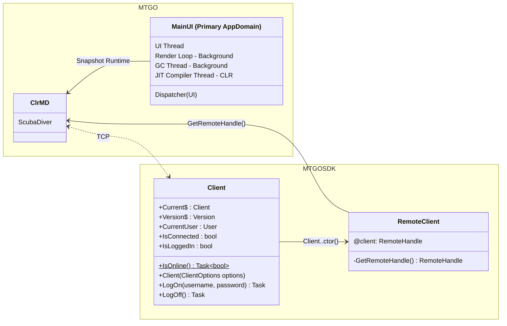

# MTGOSDK.API.Client

The [`Client`](/MTGOSDK/src/API/Client.cs) class is the main entry point for interacting with the MTGO client, managing the connection to the client and the current user session. This useful for managing both passive and active connections to the client, and helps ensure that sessions are properly managed and cleaned up when the client is closed.

Below is a UML diagram of the instantiated Client class, which propagates the connection to the MTGO client and provides a way to access remote objects in the client's memory space.



Under the hood, this class instantiates a [`RemoteClient`](../architecture/remote-client.md) instance to manage the connection to the client, and provides a way to access remote objects in the client's memory space. This class is initialized when creating a new instance of the [`Client`](/MTGOSDK/src/API/Client.cs) class or when interacting with any dynamic remote objects in the **MTGOSDK.API** namespace (refer to [`examples/GameTracker`](/examples/GameTracker) for an example of implicit instantiation).

## Initializing the Client

We can use the **Client** class to manage the connection to the MTGO client, ensuring that the session is properly terminated and cleaned up when the client is closed. This is demonstrated in the following example, which checks if the client is logged in, retrieves the current user session, and handles the client disconnection event.

```C#
using System;      // InvalidOperationException
using MTGOSDK.API; // Client

using (var client = new Client())
{
  if (!client.IsLoggedIn)
    throw new InvalidOperationException("The MTGO client is not logged in.");

  string username = client.CurrentUser.Name;
  Console.WriteLine($"The current MTGO session is under '{username}'.");

  // Teardown when the MTGO client disconnects.
  client.IsConnectedChanged += delegate(object? sender)
  {
    if (!client.IsConnected)
    {
      Console.WriteLine("The MTGO client has been disconnected. Stopping...");
      client.Dispose(); // Manually dispose of our connection to the client.
      Environment.Exit(-1);
    }
  };

  // Do something with the client session.
}
// The connection to MTGO is automatically torn down when the using block exits.
```

You can find a complete example in the [`examples/BasicBot`](/examples/BasicBot) directory, which demonstrates how to use the **Client** class to automatically start and stop the MTGO client and manage the client session. Note that for interactive use (where a user had logged in manually and is not a bot), these options are much more limited to prevent abuse.

## Using Client Events

We can also use the **Client** class to drive a simple event-based architecture, allowing us to respond to events that occur in the MTGO client. This is possible for most classes in the API but is best demonstrated in the following example, which listens for error events and logs the error message to the console.

```C#
using System;             // Exception
using MTGOSDK.API;        // Client
using MTGOSDK.API.Events; // ErrorEventCallback, ErrorEventArgs

using var client = new Client();

client.ErrorReceived += ErrorEventCallback(ErrorEventArgs args)
{
  Exception ex = args.Exception;
  Console.WriteLine($"MTGO encountered an error: {ex.Message}");

  // Handle the error event.
}
```

Many classes in the **MTGOSDK.API** namespace will aggregate and provide their own event handlers, allowing us to respond to events that occur in the MTGO client. No specific priority is given to event handlers from the **Client** class, though callbacks registered with the **Client** class should be reserved for exceptional circumstances.

## Logging Dependency Injection

As the **Client** class is intended to be the entrypoint for interacting with the MTGO client, we can also provide a custom logger to the **Client** class to log messages to a custom logging provider. This is demonstrated in the following example, which uses the **Client** class to log messages to the console.

```C#
using Microsoft.Extensions.Logging; // ILoggerFactory, LoggerFactory
using MTGOSDK.API;                  // Client

ILoggerFactory factory = LoggerFactory.Create(builder =>
{
  builder.AddConsole();
  builder.SetMinimumLevel(LogLevel.Information);
  // Add additional logging configuration here.
});

using var client = new Client(loggerFactory: factory);
```

Now we can collect logs from the **Client** class and its associated classes, and output them to the console. This is useful for debugging and monitoring the client's behavior, and can be extended to include additional logging providers such as **Serilog** or **NLog**.

You can also manually log messages to the logger by using the **Log** class provided by `MTGOSDK.Core.Logging`:

```C#
using Microsoft.Extensions.Logging; // ILoggerFactory, LoggerFactory
using MTGOSDK.API;                  // Client
using MTGOSDK.Core.Logging;         // Log

ILoggerFactory factory = LoggerFactory.Create(builder => /* ... */);
using var client = new Client(loggerFactory: factory);

Log.Trace("This is a trace message.");
Log.Debug("This is a debug message.");
Log.Information("This is an informational message.");
Log.Warning("This is a warning message.");
Log.Error("This is an error message.");
Log.Critical("This is a critical message.");
```

This will use the same **ILoggerFactory** instance that was provided to the **Client** class, and will output log messages to the logger provider with automatic type/category deduction. This is useful for logging messages from classes that do not have access to the logger provider, and are used to log messages from any class in the **MTGOSDK** library.
